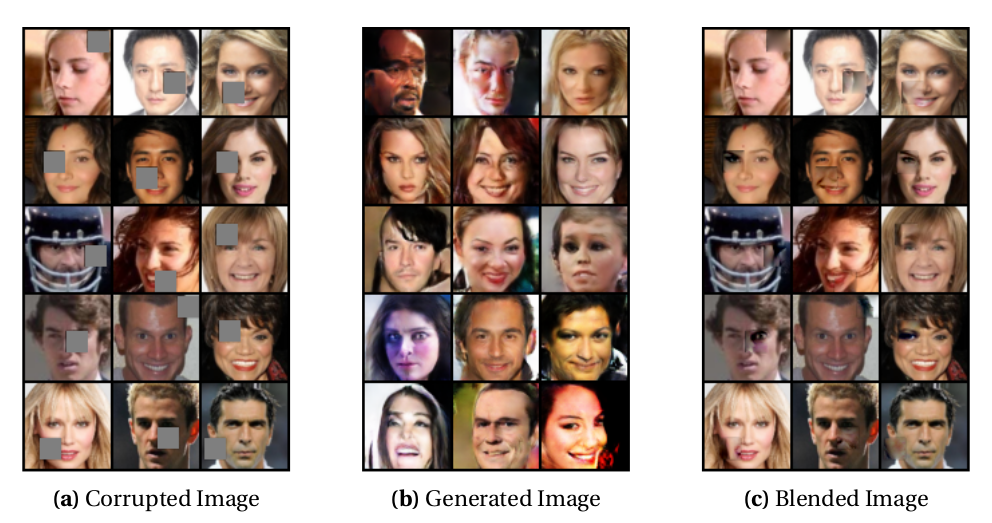
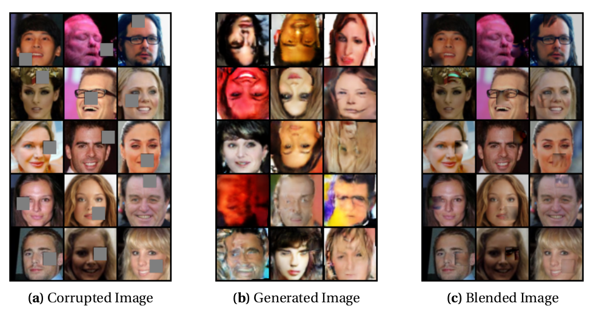
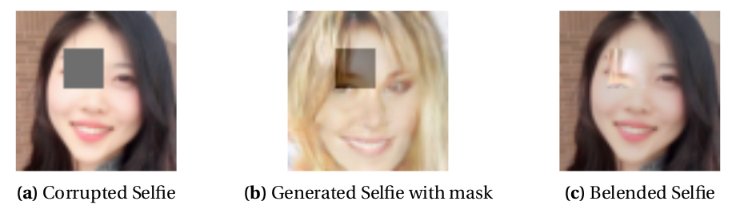

# Generative-Image-Inpainting
Generative Image Inpainting for the corrupted images using GAN

## Setup
```
python3.5
CUDA 8.0
pytorch
torchvision
matplotlib
numpy
panda
scipy
PIL
```

## Dataset 
CelebFaces Attributes Dataset ([CelebA](http://mmlab.ie.cuhk.edu.hk/projects/CelebA.html)): a large-scale face attributes dataset with more than 200K celebrity images, each with 40 attribute annotations

## Results
With the default the skeleton code and my implementation, the below celebrity pictures
are inpainted. Compared to the original paper, the outputs are a bit disappointed since the
boundary around corrupted part is not smooth as well as some samples are blur.


## Analysis and Discussion
From the experiments, I believe that there are some ways to improve our inpainting model.
- **Improve the performance of DCGAN** \
I observed that some parts of the generated images are distorted and showed non-natural
colors. Thus, I applied the data augmentation like a random zooming, rotation, flipping and
color jitters.
After training is done, I found the vertical flipping are not a good option. Also, the generated
output shows poor results comparing to the default model. I believe that the model with data
augmentation requires more training since it has more various cases to learn.

- **Improve the performance of Inpainting model** \
According to the lecture slide [1], we can make our Discriminator do wrong classification
instead of being correct, which is the same object of fooling Discriminator. By changing
our prior loss function as −λ ∗ l og (D(G(z)), we can have higher gradient signal for the bad
samples as illustrated in the below figure.
Also, I changed learning late(default=0.001) and the search time(default=1500) to find the
better latent vector.



## Author
Suhong Kim – [@github](https://github.com/suhongkim) – suhongkim11@gmail.com \
Distributed under the MIT license. See the [LICENSE.md](LICENSE.md) file for details


## Inspiration
This project is a part of the CMPT743 assignments at SFU. \
It is inspired by this paper ["Semantic Image Inpainting with Deep Generative Models"](https://arxiv.org/abs/1607.07539), and codes: [keras-GAN](https://github.com/eriklindernoren/Keras-GAN), [CelebA-GAN-DCGAN](https://github.com/znxlwm/pytorch-MNIST-CelebA-GAN-DCGAN) and [pytorch-tutorial](https://pytorch.org/tutorials/beginner/data_loading_tutorial.html)
